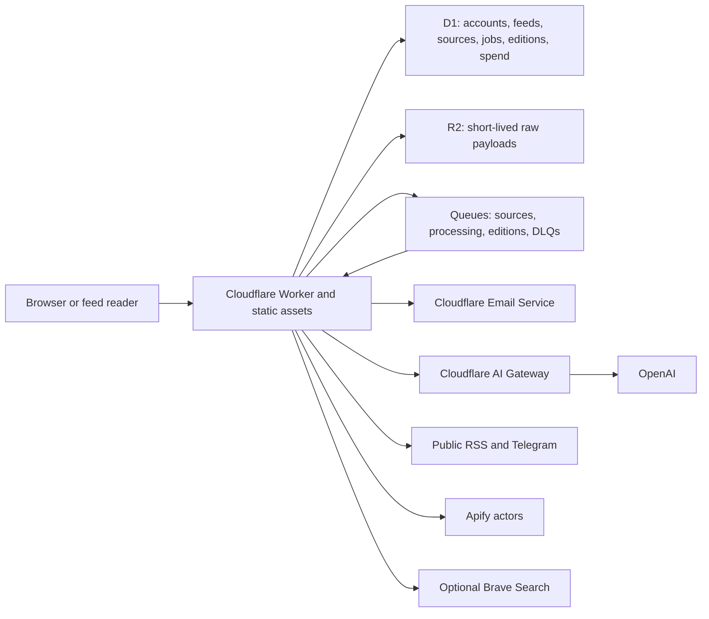

# Architecture

Distilled.news is a single Cloudflare Worker application with static React
assets and asynchronous source and publication pipelines.

## Runtime surfaces

- The Worker serves the API, public feeds, scheduled maintenance, queue
  consumers, and built web assets.
- D1 is authoritative for accounts, configuration, published content, source
  state, job state, idempotency records, and append-only spend events.
- R2 stores raw source evidence for a bounded debugging window. D1 stores the
  reference and expiration.
- Three queues isolate source collection, item processing, and edition
  publication. Each has a dead-letter queue.
- Username and feed slug form the public URL. Public feeds are intentional;
  there is no private-feed mode.
- Cookie-free status, capabilities, Explore, public feed, search, and sitemap
  reads use short release-versioned Cache API entries and single-flight miss
  coalescing. See [Public edge and signup capacity](PUBLIC-EDGE.md).

## Processing flow

1. The scheduler claims due canonical sources and due publication windows.
2. A source job fetches or starts the configured provider, records attempts and
   cost reservations, archives bounded raw evidence, and fans items out to the
   subscribed feeds.
3. Processing jobs apply rule-first relevance, optional model review, evidence
   retention, clustering, and idempotent writes.
4. Edition jobs close immutable time windows and publish either an edition or
   an explicit empty result.
5. Retention maintenance removes expired D1 content and then unreferenced R2
   payloads.

## Trust and deployment boundaries

Production and staging have distinct Worker names, D1 databases, R2 buckets,
queues, DLQs, routes, budgets, and release histories. Production has
`workers_dev` and preview URLs disabled. A bare Wrangler deploy is intentionally
invalid; every command must select a named environment.

Secrets are Cloudflare secrets, not Wrangler variables. Non-secret policy,
provider switches, actor build pins, host allowlists, compatibility date, and
budgets are version-controlled.

The product retains basic D1 search over published content. It does not use
Vectorize and has no chatbot or open-ended public Q&A surface.
