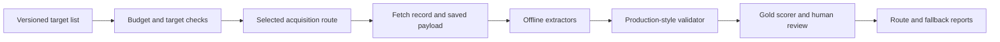

# Scraper and API Evaluation Plan

**Status:** Active methodology; the [comparison harness](../evaluation/acquisition-benchmark/README.md) is implemented and tested offline. Real provider/server evaluation remains outstanding.  
**Plan version:** scraper-eval-v1  
**Last reviewed:** 2026-09-13  
**First deliverable:** A small live provider comparison with inspectable raw responses, extracted content, quality decisions, timings, and costs.

For a summary and server execution steps covering each specific scraper/API through three stages, start with [Scraper and API Testing on the University VPS](SCRAPER_TESTING_STEPS.md).

## 1. The priority and the decision

Evaluate acquisition options before committing to new provider integrations or expanding the application around them.

The question is:

> Which acquisition route returns correct, sufficiently complete, fresh content reliably for each source we actually need, and what does that usable content cost?

The result should identify primary routes, effective fallbacks, unsupported sources, and remaining uncertainty. There is no predetermined winning provider.

Build only the common acquisition, recording, extraction, and scoring functionality needed to make this comparison trustworthy. General frontend changes, new briefing intelligence, and production infrastructure redesign are outside this milestone.

The current Cloudflare application remains the product baseline. A benchmark on a VPS does not authorize moving the application to a VPS, changing its database, or adopting the broader conceptual architecture in older documents.

### Relationship to the other documents

| Document | Role |
|---|---|
| This plan | Current acquisition priority, staged comparison procedure, scoring clarifications, and completion gates. |
| [Acquisition runbook](ACQUISITION_BENCHMARK_RUNBOOK_v1.2.md) | Background experimental design and extended fault/connector scenarios. |
| [VPS execution guide](DISTILLED_VPS_TO_ACQUISITION_BENCHMARK_FULL_GUIDE.md) | Server preparation and operations; verify its environment assumptions against the actual host. |
| [Benchmark implementation notes](../implementation/ACQUISITION_BENCHMARK_IMPLEMENTATION.md) | Description of the initial code milestone and its limitations. |
| [Implementation plan](IMPLEMENTATION_PLAN_v1.2.md) | Broader research milestones, including the separate news-intelligence replay corpus. |
| [Project instructions](../AGENTS.md) | Current product and runtime direction. |

For this experiment, use the methodological rules below where the earlier runbook differs:

- Treat repeated fetches of one URL as repeated measurements, not independent articles.
- Use `AUTO_UNVERIFIED` for live RSS disagreement.
- Separate legitimate source changes from extraction errors.
- Check anchor order as well as token coverage.
- Evaluate complete fallback policies.
- Retry eligible transient 429 responses only in the separate retry experiment; ordinary permanent 4xx errors are not retried.
- Use a modest compressed-expansion fixture, approximately 20–30 MiB after decompression.
- Start with two concurrent attempts and one browser attempt on the two-vCPU host described by the VPS guide.

## 2. What exists now

The isolated benchmark package is [evaluation/acquisition-benchmark](../evaluation/acquisition-benchmark/README.md).

| Component | Current state | Work needed for the comparison |
|---|---|---|
| Fetch records | Implemented in `bench/records.py` | Add versioned evaluation metadata without silently changing existing records. |
| URL/DNS validation | Implemented in `bench/safety.py` | Close the documented validation/connection gap and expand address tests. |
| Direct HTTP | CLI dispatch in `bench/adapters.py`, using `bench/network.py`; the earlier standalone `bench/routes/direct_http.py` remains compatible with `FetchAttempt` | Exercise real streaming, time limits, redirects, and network failures. |
| Raw storage | Implemented in `bench/storage.py` | Test repeated writes, failure recovery, and the chosen concurrency model. |
| Offline Python tests | Expanded protocol, processing, recovery and end-to-end tests | Run `python -m pytest` in the package and retain results. |
| Zyte, Bright Data, browser routes | Implemented in the benchmark | Validate real accounts and Linux browser isolation on the VPS. |
| Extractors and article validator | Implemented | Trafilatura/Readability and response-only validation operate on saved data. |
| Gold labels and scorer | Scorer implemented; real gold still required | Build independent references; synthetic fixtures only test the harness. |
| Config, CLI, jobs, reports | Implemented | Use the package README for supported commands and schemas. |
| Live provider comparison | No results established by this review | Run the pilot after the relevant readiness checks pass. |

The application also has Telegram, RSS/Google News, and Apify-backed integrations under [packages/connectors](../packages/connectors/src/index.ts) and [apps/worker/src/sources.ts](../apps/worker/src/sources.ts). Their existing fixture tests are useful baselines, but do not establish live provider reliability.

### Known cases to turn into regression tests

The repository review on 2026-09-12 found:

1. `bench/safety.py` accepted IPv4 and IPv6 multicast literals despite the implementation notes claiming they were rejected.
2. The RSS parser threw a `RangeError` on an out-of-range numeric HTML entity such as `&#99999999;`.
3. An undated Google News actor record received the fetch time as its `postedAt`.
4. An HTML access-denied response produced zero RSS items; the ingestion path can treat that as a successful empty fetch.
5. Telegram's timeout helper stops its timer after response headers arrive, before the caller consumes the body. Body-stall behavior needs a focused test.

These historical findings now have code fixes and regression coverage: unsafe addresses are rejected, invalid numeric entities become U+FFFD, undated Google News records are skipped because stored messages require a publication date, non-feed RSS responses raise a recorded error, and Telegram's deadline includes the response body. The benchmark reports dropped source records instead of concealing them. These are offline checks; live provider and VPS behavior still need validation.

## 3. Keep three comparisons separate

| Track | Unit being compared | Main question |
|---|---|---|
| A. Website acquisition — first | One article URL through each route and extractor | Did we obtain the correct article, how completely, at what latency and cost? |
| B. Platform/source collection | One account, channel, or feed over a defined interval | Which posts/items were seen or missed, and were updates collected correctly? |
| C. Discovery — later | One topic/query and time window | Which additional useful articles did the source discover? |

A Google News search result is a discovery pointer. A complete article body is an acquisition result. A Telegram post is a platform record. Report these separately so a short snippet cannot beat a full-article route merely by returning faster.

Start Track A now. Include current RSS-supplied content as a separate baseline when it genuinely includes the complete article. Begin Track B once the common recording and reporting machinery is working. Track C can follow after the core acquisition decision.

## 4. Website contenders and adapter requirements

Begin with the four routes already proposed in the project documents.

| Route ID | Variant to freeze | Output to preserve | What the pilot establishes |
|---|---|---|---|
| `direct_http` | Existing Python HTTP route, fixed headers, no harness retries | Response entity bytes and relevant headers | How much our own network can retrieve without a managed service. |
| `zyte_http` | HTTP-response mode | Decoded target body plus provider response metadata | Which direct failures the managed route recovers. |
| `brightdata_unlocker` | Selected Web Unlocker zone, raw output | Returned body plus provider metadata | Quality, recovery, and cost for the same URLs. |
| `browser_playwright` | Pinned Chromium, fresh context, fixed resource policy | Rendered DOM and network/timing metadata | Which pages benefit from rendering and its operational cost. |

These are experimental candidates. Account availability and current product behavior must be checked before enabling a route.

### Minimal integration details

- **Zyte:** use the documented extraction endpoint with `httpResponseBody` and `httpResponseHeaders`. Preserve the outer API status separately from the target `statusCode`; decode the base64 body. The documented body is already decompressed. HTTP and browser modes must remain separate variants. Custom headers may be overridden or dropped, so record requested settings and observable differences. [Official API reference](https://docs.zyte.com/zyte-api/usage/reference.html).
- **Bright Data:** the documented Web Unlocker request uses `https://api.brightdata.com/request`, a Bearer token, the selected `zone`, target `url`, and `format: raw`. Record the exact zone/settings and establish which response fields identify provider versus target errors during the pilot. [Official first-request guide](https://docs.brightdata.com/products/web-unlocker/send-your-first-request).
- **Playwright:** use a fresh context per attempt, block images/media/fonts as a fixed experiment setting, and cap navigation plus rendering time. Use request interception and disable service workers for this variant so they do not hide requests from interception. Network restrictions must also protect against DNS changes between validation and connection. [Official network documentation](https://playwright.dev/python/docs/network).

Do not assume a provider exposes its internal retry count, redirect history, cache behavior, or every upstream header. Record unavailable information as unknown. A managed route's network behavior is part of the product under test.

Optional variants, such as Zyte browser mode or a Worker-egress HTTP route, get their own IDs, settings, and costs. Add them when the initial results reveal a specific unanswered question.

Since production uses Cloudflare Workers, a VPS-only direct HTTP result is provisional for a future Worker implementation. Validate shortlisted direct-fetch behavior from the intended runtime before adoption.

## 5. Inputs to record before sending paid requests

Create a private experiment directory outside tracked source files. The existing package ignores `data/` and `.env`; verify ignore rules before saving credentials or captures.

Record these values in `data/reports/DECISIONS.md` and `ENVIRONMENT.md`:

| Input | Required record |
|---|---|
| Sources | Selected domains, article URLs, languages, and why each matters to Distilled. |
| Accounts | Provider product, account plan, enabled capabilities, and credential environment-variable names. Never record key values. |
| Spend | Pilot total cap, per-provider cap, maximum concurrent reserved spend, and operator responsible for stopping the run. |
| Pricing | Dated account-specific pricing evidence, minimum charges, billing unit, credits, and charges on failures/timeouts. |
| Host | OS, CPU/RAM, region, egress identity, interpreter/browser versions, and container image digest where used. |
| Experiment | Git commit, route versions, dataset hash, configuration hash, random seed, extractor/validator versions. |
| Access | Public target suitability, site access constraints, intended polling rate, and review date. |
| Timing | UTC schedule, attempt deadline, request spacing, and pilot start/end. |

Paid routes remain disabled until budgets are configured. Reserve the maximum expected charge before dispatch; reconcile the reservation afterward. Do not treat a local timeout as proof that a provider stopped working or charging.

Request public content within the intended access scope. Do not add login, paywall, or CAPTCHA bypass behavior. Use an identifying user agent where supported. Keep raw publisher content and secrets out of public reports.

## 6. Build the smallest complete harness

The intended flow is:



Implement in this order:

1. **Config and runner:** validate settings, enumerate the exact planned work, support dry runs, and create an attempt manifest before dispatch.
2. **Direct route and storage:** reuse existing modules; fix the relevant failure cases and verify every attempted fetch leaves a record.
3. **Offline extraction:** add Trafilatura and Mozilla Readability, each pinned. Both process the same saved HTML. Save raw extraction output and normalized text separately.
4. **Metadata and validator:** extract headline, original URL, canonical URL, publisher, language, publication/update times, and evidence for each field.
5. **Gold scorer and report:** implement the labels in section 9 and link every result to its artifacts.
6. **Managed and browser adapters:** use the same runner, limits, timing boundaries, and artifact contract.
7. **Controlled faults:** test each adapter's failure reporting and the runner's accounting.
8. **Live pilot:** compare the enabled routes on the same five article URLs.

Work on provider adapters can overlap with gold preparation. Avoid spending weeks building a general platform before the first inspectable comparison.

### Current package layout

The CLI, acquisition, extraction, validation, scoring, and reporting paths are implemented. The layout below maps those responsibilities to the current files; do not build parallel implementations from the earlier proposed filenames.

```text
evaluation/acquisition-benchmark/
  bench/
    __main__.py, cli.py          # commands, preflight, schedules and recovery
    config.py                   # validated settings and credential references
    runner.py, state.py          # durable jobs, evidence, spend and offline replay
    adapters.py, network.py      # source dispatch and bounded HTTP
    records.py, storage.py       # earlier standalone FetchAttempt API
    safety.py                   # URL and connection-address checks
    routes/
      common.py                 # shared acquisition errors, credentials and evidence
      direct_http.py            # standalone compatibility route, not the CLI route
      zyte_http.py              # provider envelope and decoded target-body handling
      brightdata_unlocker.py    # raw Unlocker response
      browser_playwright.py     # isolated Chromium, bounded interception and cleanup
    extractors/
      __init__.py               # Trafilatura/Readability subprocess dispatch
      metadata.py               # explicit HTML metadata with field provenance
    transform_worker.py         # isolated Trafilatura process
    processing.py               # source normalization; compatible processing imports
    validator.py                # response-only article acceptance, no reference input
    score.py                    # independent article/source quality scoring
    reporting.py                # JSON, CSV and Markdown reports
    gold.py, faults.py           # reference validation/discovery and mocked faults
  node/transform.mjs            # actual app parsers and Readability
  configs/                     # offline demo and three live-stage templates
  fixtures/                    # synthetic responses and reference examples
  tests/                       # mocked providers, real extractors and recovery tests
  scripts/, ops/               # setup and scheduled-service templates
  data/                        # ignored run outputs
```

Article extraction preserves the extractor's original title/date metadata and records the source of explicit HTML fields: headline, canonical URL, publisher, language, publication time, and modification time. Publication and modification remain separate. Direct HTML publication metadata can preserve a timestamp that an extractor reduces to a calendar date. These fields currently cover HTML meta/link/time elements, not comprehensive JSON-LD interpretation or inferred publisher identity.

`reporting.py` is the implemented report module; a second `report.py` is unnecessary. Source-level aggregate acceptance remains a reviewed decision even though individual source samples receive quality labels. The controlled public fault server, independent real reference corpus, and live provider/VPS campaign remain work to prepare; mocks and synthetic examples do not substitute for them.

### Artifact contract

Retain the current `FetchAttempt` shape. Add new versioned records or a documented schema revision for fields it does not yet support.

| Artifact | Required content |
|---|---|
| Run manifest | Every planned URL × route × repetition, scheduled time, random seed, dispatch status, skip reason, and configuration hashes. |
| FetchAttempt | Existing IDs, route/provider, URL, timestamps, transport, cost, raw reference, and versions. |
| Fetch metadata | Outer API status, target status if available, request ID, headers with secrets removed, redirects, cache information, cancellation outcome, and error detail. |
| Payload | Relative path, SHA-256, byte count, representation, and capture completeness. |
| Extraction | Fetch ID, extractor/version, text, headline, publisher/canonical links, language, dates, and metadata provenance. |
| Validation | Accepted/rejected, completeness estimate, reason codes, and validator version; no gold input. |
| Evaluation | Gold ID/version, label, precision/recall/F1, anchor checks, metadata checks, and reviewer decisions. |
| Policy attempt | Actual or simulated route sequence, activation reasons, end-to-end time, all charges, final validator decision, and independent quality label. |

Use relative artifact references so a run can be copied and analyzed offline.

Distinguish payload representations: HTTP entity bytes after transport decompression, provider JSON envelope, provider-returned target body, and rendered DOM. They are not all wire captures. Preserve an immutable acquisition payload before charset decoding, normalization, or extraction; record its representation explicitly.

Failures must also leave records. A denied or size-limited attempt can have a null payload with an explicit reason. Never let a missing record disappear from the denominator.

## 7. Shared conditions and stopping rules

The following are starting settings to validate during the pilot and freeze before the full comparison.

| Setting | Initial value or rule |
|---|---|
| Website attempt deadline | 45 seconds from dispatch through receipt of the bounded payload, including redirects/rendering. |
| Local redirect limit | Five hops, validating every destination. |
| Decompressed target body limit | 10 MiB; separately bound the provider envelope and account for base64 overhead. |
| Harness retries in main comparison | Zero. Record provider-internal retries as unknown unless exposed. |
| Global concurrency | Two on the described two-vCPU host. |
| Browser concurrency | One. |
| Per-domain concurrency | One across all routes/jobs. |
| Per-domain spacing | At least ten seconds, increased when target constraints require it. |
| Requested language | `ar,en;q=0.9,fr;q=0.8`, with provider limitations recorded. |
| Route order | Randomized and balanced across URLs/repetitions; save the seed. |
| Browser state | Fresh context, fixed viewport/locale and resource policy; record actual versions. |
| Extractions | Offline; timed separately from acquisition. |

Rate limits must be shared across concurrent jobs, not enforced independently in each job. For one URL, run routes close enough together to reduce content-change bias while respecting spacing. Separate warm-up traffic and its cost from measured attempts.

Provider-side redirects or headers may not be observable or controllable. Report those capability limits rather than asserting that the route honored an unverified setting. A route that cannot meet a required operational bound is ineligible for that use case, even if its content scores well.

Stop or pause the affected work when:

- A private/prohibited target is reached or the local egress boundary fails.
- A deadline, bounded-memory, or artifact-integrity defect is found.
- Reserved plus reconciled spend reaches the configured cap.
- Authentication is invalid or quota is exhausted.
- The host cannot sustain the frozen workload without measurement distortion.
- Required records are missing.

Log incomplete work as skipped/interrupted with a reason. Separate harness defects from provider failures in the report. Preserve the original run and give a repaired rerun a new ID/version.

## 8. Prepare the pilot and evaluation data

### Stage A: Five pilot articles

Select actual intended sources, with:

1. One ordinary English article.
2. One Arabic article.
3. One French article.
4. One article requiring rendering to expose its body.
5. One redirect/canonical case.

Verify the expected article manually and save a dated snapshot. A sentence missing from a direct response alone does not prove JavaScript is required: rule out blocking, language differences, and encoding first.

Use the same five URLs for every enabled route:

```text
5 URLs × 4 routes × 2 repetitions = 40 acquisition attempts
40 saved HTML/DOM results × 2 extractors = up to 80 extraction results
```

Failed attempts will produce fewer extraction results and must remain visible. Credential checks, warm-ups, fault requests, and policy-chain trials are additional work and additional cost.

The pilot verifies measurement and identifies obvious differences. Five URLs cannot establish per-domain reliability.

### Stage B: Gold collection and unseen evaluation

Expand to the runbook's 45 labelled articles across the intended languages and source categories. Include short reports, difficult permitted pages, unusual encodings, redirects, and metadata edge cases. Categories may overlap; record unique URL counts explicitly.

Mark the five pilot articles as calibration data. Keep at least the remaining 40 out of threshold/extractor tuning, and report evaluation on unseen URLs separately. Any additional article used for tuning becomes calibration data.

For each gold article record:

- Stable ID, input URL, resolved/canonical URL, domain, publisher, and language.
- Headline and body in paragraph order, excluding navigation, ads, comments, and unrelated material.
- Publication time, timezone, precision, source of that time, and modification time separately.
- Three distinctive body anchors from beginning, middle, and end, where article length permits.
- Selected boilerplate strings that should not enter the body.
- Snapshot path/hash, capture time, reviewer, categories, and dataset version.
- Explicit applicability flags for unavailable metadata or very short bodies; never invent missing dates.

Independently label ten articles twice. Compare the bodies using the same normalization and require F1 of at least 0.95 as an initial annotation-consistency gate. Resolve disagreements and record the final rule. Hide route names from human content reviewers where practical.

Gold text normalization should use Unicode NFKC, Latin lowercasing, Arabic diacritic/tatweel removal, documented alef normalization, punctuation handling, and whitespace normalization. Preserve original text for auditing.

Freeze URL identity rules. Remove only documented tracking parameters; do not discard arbitrary query parameters or equate different paths. Investigate cross-domain canonical links before treating them as the same article.

### Stage C: New daily articles

Sample up to five previously unseen articles per selected domain per day from its feeds or sitemap. Freeze the sampling rule before the run. Do not cherry-pick easy pages after seeing results.

An RSS title/snippet supplies a weak identity check, not the full ground truth. Retain `AUTO_UNVERIFIED` results for review rather than labeling them false successes.

Sample at least 20 live results per day for human review, stratified across routes, languages, and automatic labels. Report stratum counts and weighting when estimating population rates. Additionally inspect suspected false successes; targeted inspections must not be mixed into random-sample estimates.

For domains considered for adoption, obtain enough independently verified, unseen URLs to evaluate the quality gates. Aim initially for at least 30 per shortlisted domain/route, increasing the sample when intervals remain inconclusive. The 45-article cross-domain gold collection alone is insufficient for every domain.

## 9. Score content independently of provider claims

### Two separate decisions

The **production-style validator** can use only the response and extracted metadata. It must not see the gold body. It decides whether the future router would accept the result.

The **evaluation scorer** compares that decision and content with gold or independent human verification. This reveals false successes and unnecessary rejection.

An HTTP 200, successful actor status, or nonempty dataset is not enough to establish usable content.

### Validator starting rules

- Reject target/provider errors, wrong content types for the chosen task, block pages, soft 404s, consent gates, and obvious schema errors.
- Require an identifiable article/post and a usable original reference.
- Use 250 text characters as an initial article threshold, with an 80-character short-news exception supported by article metadata. Check these heuristics against pilot examples.
- Check title/language and truncation indicators; retain reasons for missing metadata separately.
- Keep `publishedAt`, `updatedAt`, `firstSeenAt`, and `fetchedAt` distinct. Unknown publication time remains unknown.
- A truncation phrase or missing final punctuation is evidence to assess, not conclusive proof by itself.

### Verified labels, applied in order

First flag `SOURCE_CHANGED` when independent snapshot review establishes that the page legitimately changed. Exclude that comparison from static body-accuracy metrics and report it separately; retain its timing and cost.

| Label | Meaning |
|---|---|
| `BLOCKED_CORRECTLY` | Expected refusal of a prohibited target or controlled refusal case. |
| `FAIL` | Transport failed or the production-style validator rejected the result. |
| `FALSE_SUCCESS` | Validator accepted, but independent verification shows a wrong/error page, body F1 below 0.50, or none of the applicable required anchors. |
| `PASS` | Validator accepted and every applicable quality requirement below passes. |
| `PARTIAL` | Validator accepted, but the result meets neither the false-success rule nor every PASS requirement. |

Initial PASS requirements:

- Body token F1 at least 0.90, counting repeated tokens.
- All applicable anchors found in the correct order.
- No labelled unrelated boilerplate strings.
- Title token similarity at least 0.90 using the frozen tokenizer.
- Verified article identity and canonical/reference handling.
- Publication time within the gold precision tolerance when available: ±5 minutes for minute precision, same hour for hour precision, or same publisher-local day for day precision.
- No invented date when the reference has no recoverable publication time.

Measure precision and recall separately: losing article paragraphs and adding unrelated text are different defects. Score metadata applicability and missingness explicitly so it cannot quietly disappear from reports.

For unlabelled live articles, use `AUTO_PASS`, `AUTO_UNVERIFIED`, or `AUTO_FAIL`. These remain separate from verified PASS/false-success metrics. Automatically flagged error signatures require adjudication when context is ambiguous.

## 10. Test faults before trusting live measurements

Run local mocks first, then a controlled HTTP fault server. Paid providers need a bounded, reachable public fixture host; the local client still needs enforced egress restrictions. Do not create a general-purpose public fetch proxy.

| Case | Expected behavior |
|---|---|
| Valid English/Arabic article | Correct extraction and references. |
| Slow headers and slow body/drip | Attempt ends within the total deadline, including body consumption. |
| Redirect loop or excess chain | Bounded failure with the redirect count/reason. |
| Private, metadata, loopback, multicast targets; unsafe redirect; changed DNS answer | Refused before a forbidden connection. Test IPv4 and IPv6. |
| Oversized body and 20–30 MiB compressed expansion | Bounded failure; measure peak memory, not just the returned error. |
| HTTP 429 | One main-comparison attempt; record Retry-After and any charges. |
| HTTP 403/404/503 | Correct target error, preserved separately from provider status. |
| HTTP 200 with error/challenge/consent content | Rejected; never counted as a correct article. |
| Malformed HTML/XML or invalid numeric entity | Explicit rejection or useful partial output without crashing the job. |
| Wrong encoding, missing dates, short article | Correct text/unknown metadata handling; no invented publication time. |
| JS-only page or endless network activity | Rendering behavior measured with a hard stop; no unbounded wait. |
| Provider 401, quota error, outage, malformed JSON, or success envelope containing an error | Correct provider classification; other routes remain runnable. |
| Process exit after fetch or during artifact write | Recoverable manifest; no silently missing attempt or corrupt referenced payload. |
| Two writers or overlapping jobs | Valid complete records, unique IDs, and enforced cross-job budgets/rates. |

Use one serialized artifact writer or a tested interprocess-safe mechanism. The existing per-instance thread lock does not establish safety across separate processes.

Use per-attempt isolation or a measured allocation method for CPU cost. Subtracting process-wide CPU counters around overlapping async requests can charge the same work to several attempts.

Test retry behavior as a separate mode: at most three total attempts, transient failures only, and all waits/attempts within one recorded policy deadline. A temporary 429 can be retried when Retry-After fits; authentication, permanent client errors, and exhausted quota are not retry loops.

## 11. Run and review the live pilot

1. Finish the target list, labels, credential checks, budget reservations, and environment record.
2. Run the relevant offline/fault checks and save their results.
3. Produce a dry-run manifest showing the exact planned requests and upper-bound spend.
4. Fetch the five URLs through the enabled routes in the recorded order, twice.
5. Save every attempt and available payload before extraction.
6. Run both extractors offline, then the validator and scorer.
7. Inspect every pilot acquisition attempt and every resulting extraction. Check content, links, dates, reasons, timing, and charges.
8. Reconcile provider usage and record timeout/billing discrepancies.
9. Fix harness defects, version the changes, and rerun the affected pilot. Preserve earlier results.
10. Publish a short pilot report stating what was measured, what is broken, and what remains uncertain.

### Pilot exit gate

- Every attempted fetch has a record; every skipped planned attempt has a reason.
- Saved payloads open and their hashes/lengths match their metadata.
- Relevant controlled safety, body/deadline, and failure-classification tests pass.
- Every candidate route is either measured or explicitly marked unavailable with the consequence for the comparison.
- Automatic labels agree with manual adjudication on at least 95% of pilot extraction results.
- No known wrong page remains accepted without a documented validator finding.
- Paid usage is visible and reconciled sufficiently to estimate the full run.
- The report identifies the next experiment without declaring a definitive provider winner from five URLs.

For scorer agreement, report separate counts per extractor. The older 38/40 criterion applies to a single 40-result classification cohort; two extractors can produce a different denominator. Do not mix fetch and extraction counts.

## 12. Extend to repeated measurement

After the pilot, freeze code/configuration, extractor choice or comparison rules, thresholds, dataset split, and randomization seed.

The full run can follow the earlier seven-day schedule:

| Job | Frequency | Purpose |
|---|---|---|
| Gold | Three runs/day | Temporal stability and regression on frozen articles. |
| Live | Daily | Previously unseen article coverage and blocking behavior. |
| Extract/score | After captures | Reproducible content evaluation. |
| Fault checks | Before the run and at its end | Detect wrapper/runtime regressions. |
| Human review/billing | Daily | Verify automatic judgments and true cost. |

The earlier example volume is 3,780 gold fetches plus 2,520 live fetches: 45 × 4 × 3 × 7 and 18 × 5 × 4 × 7 respectively. This is a planning example, not a required purchase. Extra validation articles, fault calls, and chain trials increase the total.

Record scheduled-job completion; use 95% as an initial operations gate. Report gaps and why they occurred. Missing jobs are not successful or failed content fetches, but they reduce confidence in operational reliability.

Do not tune during the frozen run. A measurement defect creates a new version and requires rerunning or extending the affected cohort. Record changes in `INCIDENTS.md`.

## 13. Metrics, sample sizes, and uncertainty

### Use defined populations

For primary verified quality, use one prespecified attempt per unique unseen URL per route: the first scheduled attempt after the evaluation freeze. Calibration URLs are excluded. Repetitions form a separate stability cohort.

Compare providers on paired URLs and compatible source versions. A provider failure remains a failure; do not drop it just because another route succeeded. Report exclusions, missing pairs, and source changes.

| Metric | Definition |
|---|---|
| Verified PASS rate | PASS / attempted URLs in the verified evaluation cohort. |
| Verified usable rate | (PASS + PARTIAL) / attempted URLs in that cohort. |
| False-success rate | FALSE_SUCCESS / attempted URLs in that cohort. |
| False acceptance among accepted | FALSE_SUCCESS / validator-accepted URLs; report in addition to the overall rate. |
| Validator unnecessary rejection | Rejected results independently found usable; report as a separate diagnostic. |
| p50/p95 acquisition latency | Distribution of all attempt durations, including timeouts, plus a separate successful-attempt distribution. |
| End-to-end latency | Acquisition plus extraction/validation, measured to the result a router can use. |
| Temporal stability | Repeated-URL label changes, content-quality variation, errors, and daily blocking rates. |
| Correct-result cost | All charges allocated to the fully verified cohort / distinct PASS results in that same cohort. |
| Operational completion | Completed scheduled jobs / scheduled jobs, with skipped/interrupted reasons. |

Report results by domain, language, and page category, along with macro averages and a separately declared traffic-weighted view. A high-volume easy domain must not hide failures on important Arabic or difficult sources.

Use 95% Wilson intervals on prespecified unique-URL binary outcomes. If using repeated observations jointly, use a documented URL-cluster method instead of pretending each repeat is independent.

Label small cohorts `INSUFFICIENT_EVIDENCE`. Even zero observed false successes in 45 independent examples does not establish that the population rate is below 1%. Publish the uncertainty rather than calling a small sample a guarantee.

Do not compute “cost per correct article” by dividing the total cost of an unlabelled live run by only its manually verified successes. Use matched cohort costs/results, or a declared sampling estimator with uncertainty. Report total live spend separately.

### Make costs comparable

Report both actual cash spent during the experiment and an estimated recurring cost without introductory credits. Include provider fees, actor/job charges, failed attempts, polling, and the allocated runtime/storage cost of the same workload. Show the allocation method and avoid counting the same shared host cost twice.

A zero provider fee does not make direct HTTP or a local browser free. Conversely, charging the entire research VPS bill to a handful of direct requests would distort the comparison. Publish marginal cost and allocated cost separately, with a sensitivity calculation for the expected acquisition volume.

Estimate the pilot ceiling from the planned number of calls multiplied by a conservative route-specific charge bound, then add credential probes, controlled-provider faults, and chain trials. If a paid route has no usable charge bound or spending control, resolve that before dispatch.

For production projections, model unique upstream resources, polling frequency, new item volume, deduplication, and fallback activation. Do not multiply every shared source fetch by the number of users who follow it.

## 14. Compare fallback chains

Evaluate these policies after standalone routes work:

```text
direct only
direct → Zyte
direct → Bright Data
direct → browser
direct → selected managed fallback → browser
```

A chain advances when the frozen production-style validator rejects a result or the route fails. It must not use gold labels to decide whether to try the next provider.

If direct HTTP returns a wrong page that the validator accepts, the chain stops and receives a false-success label. A fallback cannot rescue an error the router does not detect.

Start with an offline simulation using matched captures to estimate activation and cost. Mark it as simulated: it cannot prove sequential latency, cache behavior, or real deadline compliance.

Then run actual chains on a smaller paired set containing successful direct cases and known direct-failure cases. Freeze an end-to-end policy deadline before these trials. A provisional value is 90 seconds, with each route bounded by the smaller of its 45-second limit and the remaining policy budget; include extraction/validation in that budget. The product deadline must be reviewed independently of whichever route wins.

Report final PASS/usable/false-success rates, all incurred costs, measured p50/p95, fallback activation, browser activation, and:

```text
conditional rescue rate =
fallback PASS results among validator-detected direct failures
/ validator-detected direct failures where fallback was attempted
```

Also report failures where fallback was skipped because of time, budget, or provider unavailability. Do not advertise conditional rescue as the success rate of all direct failures.

## 15. Choose routes using quality first, then cost

Before the final run, document the engineering rationale for the thresholds. Initial website-route gates from the existing runbook are:

| Gate | Starting value |
|---|---|
| Verified PASS rate | At least 0.80 |
| Lower 95% bound of verified usable rate | At least 0.85 |
| Observed false-success rate | At most 0.01 |
| Observed false successes on gold | Zero |
| Acquisition p95 | At most 30 seconds, with timeout rate reported |
| Required safety/deadline/spend controls | Verified for the intended deployment |

The observed false-success bar is not a statistical guarantee of a population rate below 1%. Record its confidence interval and require more data or provisional deployment when evidence is limited.

Apply the gates to each relevant source category/domain. For complete chains, also require the separately frozen end-to-end deadline and operational budget.

Among eligible routes/policies, choose the lowest measured cost per correct article. Within a 10% cost band, prefer lower latency and simpler demonstrated operations. If none is eligible, mark the source unsupported or the decision provisional and state what additional experiment is needed.

A provider unavailable because of account access is `NOT_TESTED`, not a measured loser. A run with insufficient samples is `INSUFFICIENT_EVIDENCE`, not proof of reliability.

The decision record must include route and extractor versions, eligible domains, evidence window, primary/fallback, known limitations, sample sizes, costs, and re-evaluation triggers.

## 16. Test platform APIs after the shared pilot is working

Reuse run manifests, error/cost records, and reports, while keeping platform quality separate from website-body scoring.

| Source | Baseline and contenders | Required observations |
|---|---|---|
| RSS | Current parser versus [Python feedparser](https://feedparser.readthedocs.io/en/latest/introduction/) on identical saved feeds | RSS/Atom/RDF coverage, GUID stability, encoding, missing dates, conditional requests, full body versus snippet, feed-window misses. |
| Google News | Current RSS path; configured Apify fallback | Publisher identity/URL resolution, language/query behavior, 429s, dates, unique results, and fallback cost. |
| Telegram | Current public-page scraper versus Telegram API through [Telethon](https://docs.telethon.dev/en/stable/basic/signing-in.html), using a dedicated test account | Recall, media/captions, high-volume loss, edits/deletions, stable IDs, and incremental recovery. |
| X accounts | Current Apify actor versus [official user-post retrieval](https://docs.x.com/x-api/users/get-posts) and [Bright Data profile-based post discovery](https://docs.brightdata.com/api-reference/scrapers/social-media-apis/twitter-posts-discover-by-profile-url) where available | Account coverage, long text, pagination, reply/repost policy, edits/deletions, freshness, and price per collected/useful post. |
| X searches | Current Apify search mode versus [official search](https://docs.x.com/x-api/posts/search/introduction) | Query equivalence, supported time windows, result caps, useful unique posts, and cost. |
| LinkedIn companies | Current Apify company-post actor versus [Bright Data company-post discovery](https://docs.brightdata.com/api-reference/scrapers/social-media-apis/linkedin-posts-discover-by-company-url) | Company coverage, text/media, dates, duplicates, update detection, and cost. |
| LinkedIn profiles | Current Apify profile-post actor versus [Bright Data profile-post discovery](https://docs.brightdata.com/api-reference/scrapers/social-media-apis/linkedin-posts-discover-by-profile-url) | Profile coverage, accessible fields, completeness, identity, dates, and cost. |
| Other Apify actors | The explicitly configured actor versus a task-equivalent alternative, if needed | Actor-specific schemas, incomplete/demo datasets, identity, dates, and cost. |

LinkedIn is supported by the current application; its inclusion should follow actual source needs rather than an older document's exclusion.

The official LinkedIn Posts API is an additional candidate only where the required read permissions and organization/member access are available. Record its eligible targets separately; it is not a guaranteed way to retrieve arbitrary public profiles or companies. [Official Posts API permissions](https://learn.microsoft.com/en-us/linkedin/marketing/community-management/shares/posts-api?view=li-lms-2026-03).

Bright Data social discovery endpoints are distinct from the website Web Unlocker variant. Confirm the selected input mode, such as profile, company, query, or known post URL. Fetching a supplied post URL cannot establish discovery completeness for an account.

### Apify baselines configured in this repository

These defaults come from [Worker configuration](../apps/worker/wrangler.toml) and [source detection](../packages/connectors/src/sources.ts), inspected on 2026-09-12. They identify baselines to measure, not verified live capabilities or recommended winners.

| Source | Default actor ID |
|---|---|
| Google News fallback | `groupoject/google-news-scraper` |
| X profile/search | `kaitoeasyapi/twitter-x-data-tweet-scraper-pay-per-result-cheapest` |
| LinkedIn company posts | `harvestapi/linkedin-company-posts` |
| LinkedIn profile posts | `harvestapi/linkedin-profile-posts` |

Record the actor actually selected by the source/environment, its build/version, input settings, and account entitlement. A custom `apify:` source may use another actor. Compare individual actors rather than assigning a single quality score to the Apify platform.

### Match inputs before comparing output

Use the same account/channel/feed list, observation window, and requested content policy. Keep X profile collection and keyword search as separate experiments. For Google News, match query, region, and language; evaluate retrieved pointers separately from full article bodies. For RSS parser comparisons, replay identical captured bytes. Record unsupported filters and account restrictions instead of silently changing the comparison.

For Apify, test submission, polling to terminal state, dataset retrieval with pagination, schema validation, and reconciliation to the run's usage. Pin the actor/build and input schema where possible. An actor finishing successfully does not establish useful output. Follow the current [Actor-run API](https://docs.apify.com/api/v2/actors-runs-post) and [dataset pagination documentation](https://docs.apify.com/api/v2/dataset-items-get).

Use separate, bounded actor-job deadlines; do not confuse an asynchronous collection run's completion time with a single website request. Record polling overhead and whether cancellation actually stopped billable work.

Begin with team-controlled channels/accounts and a known event ledger, then real public sources. The ledger should include multilingual posts, media, long text, edits, deletions, and posts arriving during a simulated outage. Publishing test posts requires explicit authorization from the account/channel owner.

Measure:

- Recall against known expected IDs, not just returned item count.
- Duplicate items after repeating a poll and after restart.
- Text/media completeness and original-reference correctness.
- Publication-to-first-seen delay, with polling cadence reported.
- Edit/deletion detection delay and unsupported behavior.
- Recovery after interruption between fetch, persistence, queueing, and checkpoint update.
- Charges for runs, pages, records, polling, and failures.

Reference-provider output is not automatically ground truth. Investigate gaps using the controlled ledger or source inspection. A union of providers is useful for discovery of missing IDs but cannot prove that all providers did not miss the same post.

## 17. Available commands

### Existing offline package

From the repository root on Windows PowerShell:

```powershell
python -m venv evaluation/acquisition-benchmark/.venv
& ./evaluation/acquisition-benchmark/.venv/Scripts/python.exe -m pip install -c evaluation/acquisition-benchmark/constraints.txt -e "./evaluation/acquisition-benchmark[dev,sources,extract]"
npm.cmd ci --prefix evaluation/acquisition-benchmark/node --ignore-scripts --no-audit --no-fund
& ./evaluation/acquisition-benchmark/.venv/Scripts/python.exe -m pytest evaluation/acquisition-benchmark/tests
```

Use a Python interpreter compatible with the pinned dependencies and record its exact version. The earlier harness plan targets Python 3.12; the package now requires Python 3.12 or newer. Dependency installation and test execution must establish the actual supported environment.

These tests do not call paid providers. Root `pnpm test` runs application TypeScript tests and does not execute the Python benchmark.

### Executable command reference

The [benchmark README](../evaluation/acquisition-benchmark/README.md) is the current command and configuration reference. Run the following from `evaluation/acquisition-benchmark` with its environment active. First copy `configs/stage1-pilot.json` to `configs/stage1.local.json` and configure its inputs, references, credentials path, enabled routes, and spending bounds:

```text
python -m bench preflight --config configs/stage1.local.json
python -m bench plan --config configs/stage1.local.json --output data/planned-pilot.json
python -m bench faults --output data/faults.json
python -m bench fetch --config configs/stage1.local.json --run-id pilot-001
python -m bench extract --data-dir data/live --run-id pilot-001
python -m bench score --data-dir data/live --run-id pilot-001
python -m bench report --data-dir data/live --run-id pilot-001
```

`preflight` and `plan` should be local and nonbillable. Any live credential probe is a separately enumerated, budgeted request. Offline extract/score/report commands must never refetch content.

The runner persists known remote IDs and requires manual reconciliation of uncertain submissions. Do not blindly replay a request that may already have created a paid actor run.

## 18. Earlier pilot schema sketch

This historical schema sketch is retained for methodology context. Use `evaluation/acquisition-benchmark/configs/stage1-pilot.json` for the implemented version-1 format; do not execute the older sketch below. Monetary values remain unset deliberately; an enabled paid route without a configured cap must fail preflight.

```yaml
version: scraper-eval-v1
mode: pilot
dataset: gold/pilot.jsonl
seed: 20260912
repetitions: 2
limits:
  attempt_deadline_seconds: 45
  max_redirects: 5
  max_target_bytes_decompressed: 10485760
  harness_retries: 0
  global_concurrency: 2
  browser_concurrency: 1
  per_domain_concurrency: 1
  per_domain_min_interval_seconds: 10
budget:
  total_usd: null
  reserve_before_dispatch: true
routes:
  direct_http:
    enabled: true
  zyte_http:
    enabled: false
    credential_env: ZYTE_API_KEY
    max_spend_usd: null
  brightdata_unlocker:
    enabled: false
    credential_env: BRIGHTDATA_API_TOKEN
    zone_env: BRIGHTDATA_UNLOCKER_ZONE
    max_spend_usd: null
  browser_playwright:
    enabled: false
    block_resources: [image, media, font]
extractors: [trafilatura, readability]
artifacts:
  root: data
  redact_secrets: true
```

The four-route pilot requires explicitly enabling the remaining routes after setup. A direct-only preflight or smoke test is not the completed comparison.

## 19. Required reports and a practical work sequence

Store private run artifacts under the ignored data root. Commit only reviewed summaries, nonsecret configuration, annotation rules, and code.

```text
data/reports/
  ENVIRONMENT.md
  DECISIONS.md
  PILOT_REPORT.md
  route_stats.csv
  policy_stats.csv
  faults.md
  costs.csv
  connectors.md
  routing_policy.yaml
  INCIDENTS.md
  FINAL_ACQUISITION_REPORT.md
```

Every route-stat row should contain domain/category, route and extractor versions, unique verified URLs, repetitions, PASS/PARTIAL/FAIL/false-success counts, confidence intervals, latency, total/allocated cost, and decision status.

Use this decision table in the pilot report:

| Source/category | Routes actually tested | Content findings | Failure findings | Measured cost | Provisional next step |
|---|---|---|---|---|---|
| Fill from the run | Include unavailable variants separately | Link example captures | Link fault records | State estimated versus reconciled | More samples, candidate primary/fallback, or unsupported |

Suggested execution sequence:

| Work package | Completion evidence |
|---|---|
| 1. Freeze pilot inputs and budgets | Five labelled URLs, account capability records, environment and decision files. |
| 2. Complete common runner and direct path | Offline replay plus recorded success/failure and validated artifacts. |
| 3. Add extraction and candidates | Same pilot input accepted by every enabled adapter; inspectable outputs. |
| 4. Run controlled faults and live pilot | Pilot report with adjudication and reconciled usage. |
| 5. Freeze and expand | Versioned unseen dataset and seven-day schedule sized to the budget. |
| 6. Compare policies and platform behavior | Actual chain trials, connector recall/recovery results, and decision records. |
| 7. Validate adoption | Shortlisted behavior confirmed in the intended runtime and a bounded staging trial. |

These are gates rather than promised dates. Account availability, labelling, and provider behavior can change the duration.

## 20. Completion criteria

### The first milestone is complete when

- [ ] The enabled routes have run against identical pilot inputs.
- [ ] Every attempt is traceable to a record and available raw artifact.
- [ ] Both extractors have been compared on the captured content.
- [ ] Content quality has been independently checked.
- [ ] Relevant faults are classified correctly and bounded.
- [ ] Paid usage has been reconciled and uncertainties recorded.
- [ ] The pilot report explains the next measurement needed.

### Provider selection is complete when

- [ ] Quality gates have been evaluated on sufficient unseen, verified samples.
- [ ] Repeated measurements establish the observed reliability window.
- [ ] The proposed fallback actually recovers detected primary failures.
- [ ] The complete policy meets the chosen deadline and budget.
- [ ] Source-specific collection gaps and unsupported cases are documented.
- [ ] Intended-runtime validation supports the proposed deployment.
- [ ] A versioned decision identifies the primary, fallback, limits, and confidence for each supported source category/domain.

After adoption, run a small scheduled canary set through the chosen routes, retain fixtures from new failures, and trigger re-evaluation after sustained quality degradation, schema changes, or material pricing changes. Keep the comparison artifacts so future providers can be assessed against the same method.
