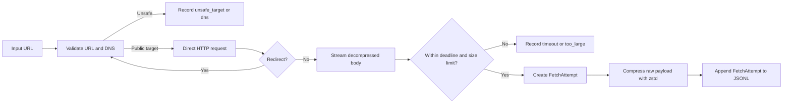

# Acquisition Benchmark Implementation

**Status:** First runnable testing milestone  
**Implementation:** `evaluation/acquisition-benchmark/`  
**Architecture target:** Distilled.news v1.2 acquisition benchmark

## Purpose

This implementation starts the test harness used to compare acquisition routes such as direct HTTP, Zyte, Bright Data, and Playwright.

The current milestone does **not** choose a winning scraper yet. It establishes the common behavior every route must use so later comparisons are fair, safe, and reproducible.

The implemented flow is:



## Implemented Modules

### Common records

File: `evaluation/acquisition-benchmark/bench/records.py`

Defines the provider-neutral records that all acquisition routes will produce:

- `FetchAttempt`: identifies the run, route, input, timing, result, cost, and versions.
- `TransportRecord`: stores HTTP status, resolved URL, redirect count, byte count, content type, and error type.
- `CostRecord`: stores estimated provider cost, billed units, and local CPU time.
- `VersionRecord`: stores harness, route, and benchmark-configuration versions.
- `ErrorType`: provides consistent error categories across routes.

`FetchAttempt.to_dict()` serializes Python field names into the camel-case JSON shape defined by the v1.2 benchmark runbook. This allows direct HTTP and future providers to be analyzed using the same reporting code.

Current run kinds are:

```text
gold
live
fault
provider_failure
```

Current error categories include:

```text
timeout
dns
connect
tls
too_many_redirects
too_large
rate_limited
blocked
server_error
client_error
unsafe_target
provider_unavailable
provider_auth
provider_quota
other
```

### URL and DNS safety

File: `evaluation/acquisition-benchmark/bench/safety.py`

The safety layer runs before the first HTTP request and again before every redirect request.

It currently:

- allows only `http` and `https`;
- requires a hostname;
- rejects usernames and passwords embedded in URLs;
- rejects `localhost` and `.localhost` names;
- resolves DNS names before acquisition;
- rejects a hostname if **any** returned address is non-public;
- handles IPv4 and IPv6 literals;
- separates DNS failures from unsafe targets.

The implementation relies on Python's `ipaddress.ip_address(...).is_global`. This rejects loopback, private, link-local, multicast, reserved, documentation, and other non-global address ranges. It therefore covers the private and metadata ranges required by the v1.2 guide, including:

```text
127.0.0.0/8
10.0.0.0/8
172.16.0.0/12
192.168.0.0/16
169.254.0.0/16
100.64.0.0/10
::1
fc00::/7
fe80::/10
```

### Direct HTTP route

File: `evaluation/acquisition-benchmark/bench/routes/direct_http.py`

`DirectHttpRoute` is the zero-provider-cost baseline route.

Implemented defaults:

| Setting | Value |
|---|---:|
| Total wall-clock deadline | 45 seconds |
| Maximum redirects | 5 |
| Maximum decompressed body | 10 MiB |
| Internal retries | 0 |
| Acquisition method | `direct_http` |
| Acquisition provider | `self` |
| Route version | `direct_http@1` |

The route:

1. validates the initial target;
2. sends an HTTP GET with fixed benchmark headers;
3. handles redirects manually;
4. resolves and validates each redirect target before requesting it;
5. streams the decompressed response body;
6. stops if the decompressed-byte limit is exceeded;
7. applies one deadline to the complete attempt, including redirects;
8. classifies common HTTP and network failures;
9. measures wall-clock latency and local CPU time;
10. returns a common `FetchAttempt` and optional raw payload.

HTTPX automatic redirects are disabled. Environment proxy variables are also ignored for the route's own client so machine-specific proxy configuration does not silently change the direct-route measurement.

HTTP status classification currently uses:

| Status | Classification |
|---|---|
| 2xx | transport success |
| 401 or 403 | `blocked` |
| 429 | `rate_limited` |
| other 4xx | `client_error` |
| 5xx | `server_error` |
| other non-2xx | `other` |

An HTTP 2xx response means only that transport succeeded. It does **not** mean that article extraction succeeded. Block-page and article-quality detection belong to the later validator milestone.

### Artifact storage

File: `evaluation/acquisition-benchmark/bench/storage.py`

`ArtifactStore` persists reproducible benchmark evidence:

```text
data/
├── raw/<date>/<fetchId>.<type>.zst
└── fetches/<date>.jsonl
```

Storage behavior:

- raw response bytes are compressed with zstd level 3;
- the compressed payload is written to a temporary file first;
- `os.replace` atomically moves the completed file into place;
- content types map to `html`, `json`, `xml`, or `bin` extensions;
- the resulting relative path is written to `rawPayloadRef`;
- fetch records are appended as one compact UTF-8 JSON object per line;
- raw payload files are written before their referencing JSONL record.

This supports the benchmark rule:

```text
fetch once -> save raw -> extract many times offline
```

### Python package and dependency isolation

Files:

```text
evaluation/acquisition-benchmark/pyproject.toml
evaluation/acquisition-benchmark/.gitignore
evaluation/acquisition-benchmark/README.md
```

Pinned runtime dependencies:

```text
httpx==0.28.1
zstandard==0.23.0
```

Pinned test dependency:

```text
pytest==8.4.1
```

The package requires Python 3.10 or newer and configures strict Pyright checking.

The ignore rules exclude:

- `.venv` and Python build/test caches;
- `.env` secrets;
- generated benchmark data;
- full gold JSONL records;
- saved article snapshots.

This prevents credentials, raw publisher content, and generated artifacts from entering the public repository accidentally.

## Tests Implemented

The suite contains **20 passing tests** and does not contact real publishers.

### Record tests

File: `evaluation/acquisition-benchmark/tests/test_records.py`

Verifies that a `FetchAttempt` serializes into the v1.2 runbook shape, including nested transport, cost, version, and error fields.

### Safety tests

File: `evaluation/acquisition-benchmark/tests/test_safety.py`

Verifies rejection of:

- IPv4 loopback;
- RFC 1918 private IPv4;
- cloud metadata/link-local IPv4;
- CGNAT IPv4;
- IPv6 loopback;
- private IPv6;
- `localhost`;
- non-HTTP schemes;
- credentials embedded in URLs;
- a hostname with mixed public and private DNS answers.

It also verifies acceptance and normalization of a public HTTPS target.

### Direct HTTP tests

File: `evaluation/acquisition-benchmark/tests/test_direct_http.py`

Uses HTTPX's in-memory mock transport to verify:

- successful HTML retrieval;
- fixed `User-Agent` and `Accept-Language` headers;
- private redirect rejection before the redirected request is sent;
- decompressed-response size enforcement;
- HTTP 429 classification;
- one total attempt deadline;
- DNS-failure classification;
- malformed URLs still producing a failed `FetchAttempt`.

### Storage test

File: `evaluation/acquisition-benchmark/tests/test_storage.py`

Verifies that:

- a raw HTML body is zstd-compressed;
- decompression reproduces the exact original bytes;
- the expected dated path is generated;
- one valid append-only JSONL record is written;
- `rawPayloadRef` points to the stored artifact.

## Running the Tests

From the repository root on Windows PowerShell:

```powershell
python -m venv evaluation\acquisition-benchmark\.venv
& evaluation\acquisition-benchmark\.venv\Scripts\python.exe -m pip install --upgrade pip setuptools
& evaluation\acquisition-benchmark\.venv\Scripts\python.exe -m pip install -e "evaluation\acquisition-benchmark[dev]"
& evaluation\acquisition-benchmark\.venv\Scripts\python.exe -m pytest evaluation\acquisition-benchmark\tests -q
```

Expected result:

```text
20 passed
```

## What Is Not Implemented Yet

The following guide components are still planned:

- command-line and scheduled job runner;
- YAML configuration loading and validation;
- controlled fault website;
- Dockerfile and Docker Compose services;
- network-level SSRF protection and DNS pinning;
- Trafilatura extraction;
- Mozilla Readability extraction;
- metadata extraction;
- production-style article validator;
- gold labels and scoring;
- Zyte HTTP adapter;
- Bright Data Web Unlocker adapter;
- Playwright browser route;
- RSS, Telegram, X, GDELT, and Google News connector benchmarks;
- route statistics, cost reconciliation, and final routing-policy reports.

### Important current security limitation

The application validates DNS immediately before each direct HTTP request, but the operating system and HTTP client perform their own connection resolution afterward. A DNS response could theoretically change between validation and connection.

Therefore, the current direct route is appropriate for local controlled tests but should **not** yet be exposed as a service that accepts arbitrary untrusted URLs. Before VPS execution, the route needs connection-level address pinning or network egress rules that block private, link-local, loopback, and metadata ranges independently of application validation.

## Next Implementation Milestone

The next useful vertical slice is:

1. add validated YAML configuration;
2. add a CLI/job runner that invokes `DirectHttpRoute` and `ArtifactStore`;
3. build a token-protected controlled fault site;
4. test redirect loops, slow responses, 429/503, malformed HTML, oversized bodies, and compressed expansion;
5. add Docker and Compose with only Caddy exposed publicly;
6. enforce network-level private-address blocking;
7. run a local fault-suite smoke test before using the professor-provided VPS.

After that foundation passes, offline Trafilatura and Readability extraction can be added without refetching pages. Provider adapters should come only after the direct baseline, fault suite, and storage pipeline are stable.
